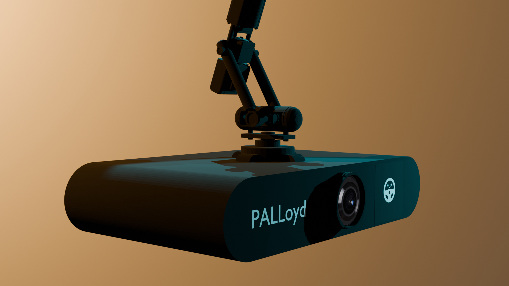
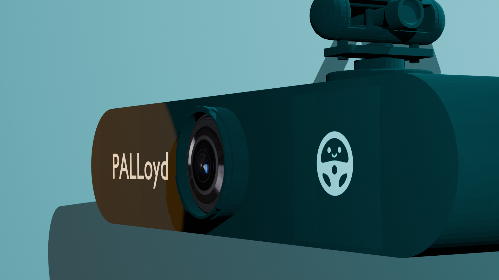
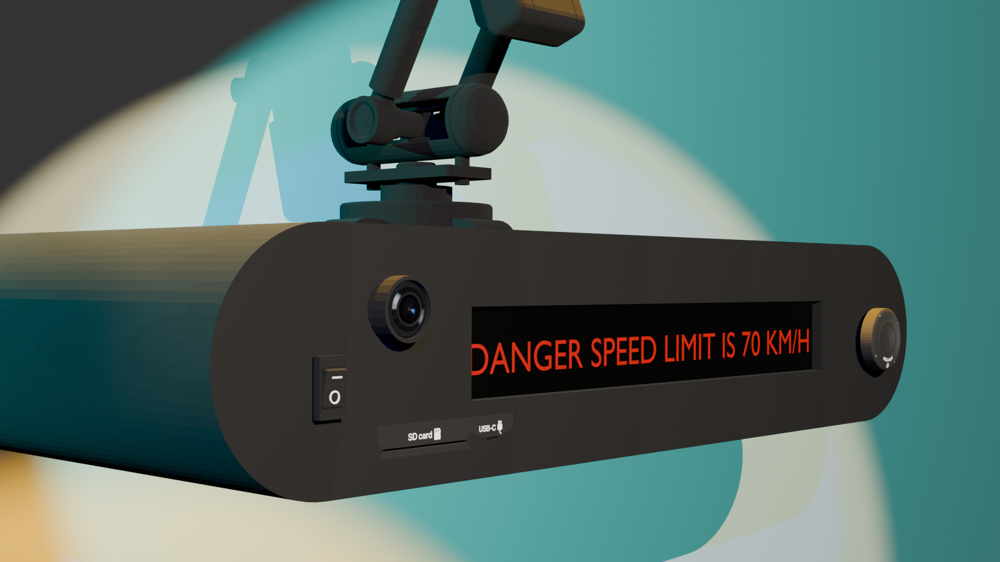

# PALLoyd - Smart Driving Assistant (3D Model)

## 📄 Overview
PALLoyd is a high-fidelity 3D concept model for a next-generation smart dashcam and driver assistant. Designed with a friendly aesthetic and safety-first functionality, this device bridges the gap between standard recording and active driver alerts.

This repository contains the 3D assets, texture maps, and render setups for the PALLoyd device.

## 📸 Visuals

**Full Device View**  

**Front Facing (Road View)**  

**Rear Interface (Driver View)**  

## ✨ Key Features (Design Specs)

Based on the 3D concept, the PALLoyd device features the following design elements:

### Dual-Camera System
* **Front:** Large aperture wide-angle lens for high-resolution road recording, situated centrally on the front face.
* **Rear:** Integrated, compact driver-monitoring camera for fatigue and distraction detection, positioned on the front face next to the main camera.

### Smart Interface
* **LED/LCD Matrix:** A wide-aspect display is designed for real-time text alerts (e.g., "DANGER SPEED LIMIT IS 70 KM/H"). The "PALLoyd" branding is prominently placed here.
* **Status Indicators:** Minimalist status LED indicators (represented by the small orange dots in the model outline).

### Connectivity & Storage
* **USB-C Port:** Located on the side/rear for power and data transfer.
* **Micro SD Card Slot:** For secure local storage of footage.

### Physical Controls
* **Power Rocker Switch (I/O):** Dedicated switch for reliable power control.
* **Navigational Dial/Button:** A multi-function control located on the front face (indicated by the square outline) for menu navigation and quick actions.

### Mounting
* **Robotic Arm Mount:** A multi-jointed, adjustable robotic arm provides flexible and stable mounting to the windshield or dashboard.

## 🛠️ Technical Details
* **Formats Available:** .glb
* **Poly Count:** 35,000 (Estimate for high-detail concept model)
* **Materials:** PBR Textures (High-Gloss Plastic Casing, Glass Lenses, Emissive Screens)
* **Render Engine:** Cycles / Eevee

## 🚀 Usage
This model is suitable for:
* Automotive UI/UX visualizations and marketing materials.
* Product design prototyping and concept validation.
* Game assets (detailed props for vehicle interiors).
* High-fidelity simulations for driver safety technology development.

Created by [TempleOS]
