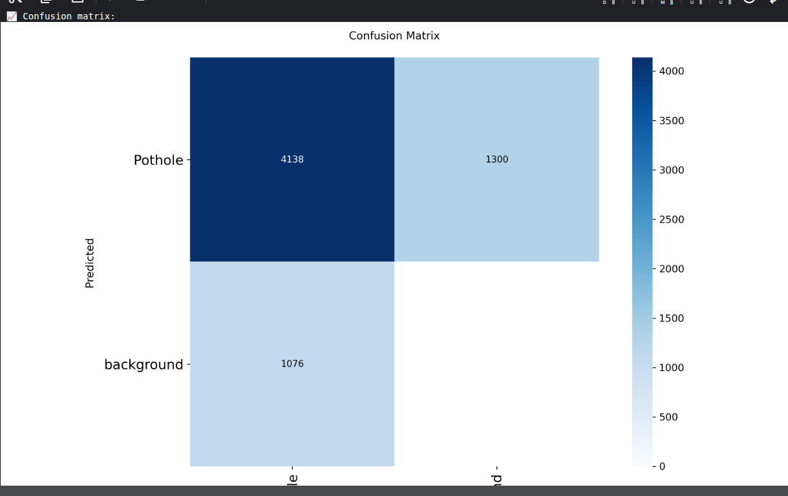

# Pothole Detection - YOLOv8 Training

Train a YOLOv8-Nano model for real-time pothole detection as part of an Advanced Driver Assistance System (ADAS).

**Team:** TempleOS  
**Event:** Hack For Good 4.0

## Overview

This project trains a YOLOv8-Nano model to detect potholes on roads for ADAS applications. The model is optimized for:
- Real-time inference on edge devices
- High accuracy for road hazard detection
- Small model size (~6 MB) for embedded systems
- Single-class detection focused on potholes

## Dataset

- **Total Images:** 9,240
- **Training Set:** 7,392 images
- **Validation Set:** 1,848 images
- **Classes:** 1 (pothole)

### Classes

| ID | Class Name | Description |
|----|------------|-------------|
| 0  | pothole    | Road pothole |

### Dataset Source

This project uses the publicly available **New Pothole Detection** dataset hosted on Roboflow Universe:

**Link:** https://universe.roboflow.com/smartathon/new-pothole-detection/dataset/2  
**Author:** Smartathon  
**License:** Public Domain  
**Direct download (YOLOv8 format):** Available on the Roboflow page above (export as "YOLOv8")

## Requirements

```bash
ultralytics>=8.0.0
opencv-python-headless
PyYAML
matplotlib
numpy
torch>=2.0.0
```

## Training on Kaggle

1. **Setup Notebook:**
   - Create new Kaggle notebook
   - Enable GPU (Settings → Accelerator → GPU T4 x2)
   - Upload your dataset

2. **Install Dependencies:**
```python
!pip install -q ultralytics opencv-python-headless PyYAML
```

3. **Train Model:**
```python
from ultralytics import YOLO

model = YOLO('yolov8n.pt')
results = model.train(
    data='data.yaml',
    epochs=100,
    imgsz=640,
    batch=16,
    device=0,
    amp=False,
    workers=0,
    cache=False,
)
```

4. **Download Model:**
   - Navigate to `/kaggle/working/outputs/model/`
   - Download `best.pt`

## Configuration

```python
EPOCHS = 100        # Training epochs
BATCH_SIZE = 16     # Batch size
IMAGE_SIZE = 640    # Input image size
PATIENCE = 20       # Early stopping patience
```

## Training Results

Model: **YOLOv8n** trained for 100 epochs on the New Pothole Detection dataset.

### Key Metrics (from best.pt)

| Metric          | Value    |
|-----------------|----------|
| **mAP50-95**    | 0.55     |
| **mAP50**       | 0.85     |
| **Precision**   | 0.85     |
| **Recall**      | 0.76     |
| **Model Size**  | ~6.2 MB  |

**Observations from training curves:**
- Loss curves (box, cls, dfl) show steady decrease over 100 epochs
- Precision improved from ~0.5 to ~0.85
- Recall improved from ~0.4 to ~0.76
- No signs of overfitting - validation metrics track training metrics

### Confusion Matrix



| Actual / Predicted | Pothole | Background |
|--------------------|---------|------------|
| **Pothole**        | 4,138   | 1,300      |
| **Background**     | 1,076   | -          |

**Observations from confusion matrix:**
- 4,138 potholes correctly detected (True Positives)
- 1,300 potholes missed (False Negatives)
- 1,076 false positives from background regions
- Some confusion with similar road textures (shadows, cracks, stains)

## Usage

### Inference
```python
from ultralytics import YOLO

model = YOLO('best.pt')

# Single image
results = model('test_image.jpg')

# Video
results = model('dashcam_video.mp4')

# Live camera
results = model(source=0)
```

### Export to ONNX
```python
model = YOLO('best.pt')
model.export(format='onnx')
```

### Export to TFLite
```python
model = YOLO('best.pt')
model.export(format='tflite')
```

## Troubleshooting

**Out of Memory:** Reduce batch size to 8
```python
BATCH_SIZE = 8
```

**Resume Training:**
```python
model = YOLO('last.pt')
model.train(resume=True)
```

## ADAS Integration Example

```python
import cv2
from ultralytics import YOLO

model = YOLO('best.pt')
cap = cv2.VideoCapture(0)

while True:
    ret, frame = cap.read()
    results = model(frame)
    
    for box in results[0].boxes:
        label = model.names[int(box.cls[0])]
        confidence = float(box.conf[0])
        
        if confidence > 0.5:
            print(f"Pothole detected! Confidence: {confidence:.2f}")
    
    annotated = results[0].plot()
    cv2.imshow('Pothole Detection', annotated)
    
    if cv2.waitKey(1) & 0xFF == ord('q'):
        break

cap.release()
cv2.destroyAllWindows()
```

## Project Structure

```
outputs/
├── model/
│   ├── best.pt                  # Main trained model
│   ├── last.pt                  # Last checkpoint
│   └── pothole_model.onnx       # ONNX export
├── pothole_training/
│   ├── results.png              # Training curves
│   ├── confusion_matrix.png     # Confusion matrix
│   └── weights/
│       ├── best.pt
│       └── last.pt
├── predictions.png              # Sample predictions
└── data.yaml                    # Dataset configuration
```

---

**Team TempleOS** | Hack For Good 4.0
