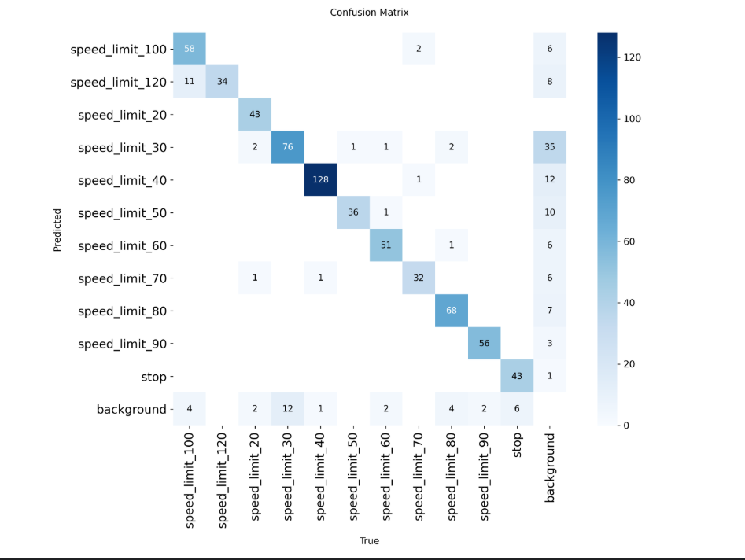

# Speed Limit Detection - YOLOv8 Training
Train a YOLOv8-Nano model for real-time speed limit sign detection as part of an Advanced Driver Assistance System (ADAS).

**Team:** TempleOS  
**Event:** Hack For Good 4.0

## Overview
This project trains a YOLOv8-Nano model to detect speed limit signs for ADAS applications. The model is optimized for:
- Real-time inference on edge devices
- High accuracy for traffic sign detection
- Small model size (~3 MB) for embedded systems
- Multiple speed limit classes (20-120 km/h + stop signs)

## Dataset
- **Total Images:** 3,421
- **Training Set:** 2,743 images
- **Validation Set:** 678 images
- **Classes:** 11 (speed limits 20-120 km/h + stop sign)

### Classes
| ID | Class Name        | Description              |
|----|-------------------|--------------------------|
| 0  | speed_limit_100   | 100 km/h speed limit     |
| 1  | speed_limit_120   | 120 km/h speed limit     |
| 2  | speed_limit_20    | 20 km/h speed limit      |
| 3  | speed_limit_30    | 30 km/h speed limit      |
| 4  | speed_limit_40    | 40 km/h speed limit      |
| 5  | speed_limit_50    | 50 km/h speed limit      |
| 6  | speed_limit_60    | 60 km/h speed limit      |
| 7  | speed_limit_70    | 70 km/h speed limit      |
| 8  | speed_limit_80    | 80 km/h speed limit      |
| 9  | speed_limit_90    | 90 km/h speed limit      |
| 10 | stop              | Stop sign                |

### Dataset Source
This project uses the publicly available **Speed Limit Signs** dataset hosted on Roboflow Universe:

**Link:** https://universe.roboflow.com/omar-magharba-czzu8/speed-limit-m0jcw/dataset/4  
**Author:** Omar Magharba  
**License:** CC BY 4.0  
**Direct download (YOLOv8 format):** Available on the Roboflow page above (export as “YOLOv8”)


## Requirements
```bash
ultralytics>=8.0.0
opencv-python-headless
PyYAML
matplotlib
numpy
torch>=2.0.0
```

## Training on Kaggle

1. **Setup Notebook:**
   - Create new Kaggle notebook
   - Enable GPU (Settings → Accelerator → GPU T4 x2)
   - Upload your dataset

2. **Install Dependencies:**
```python
!pip install -q ultralytics opencv-python-headless PyYAML
```

3. **Train Model:**
```python
from ultralytics import YOLO

model = YOLO('yolov8n.pt')
results = model.train(
    data='data.yaml',
    epochs=100,
    imgsz=640,
    batch=16,
    device=0,
    amp=False,
    workers=0,
    cache=False,
)
```

4. **Download Model:**
   - Navigate to `/kaggle/working/outputs/model/`
   - Download `best.pt`

## Configuration
```python
EPOCHS = 100        # Training epochs
BATCH_SIZE = 16     # Batch size
IMAGE_SIZE = 640    # Input image size
PATIENCE = 20       # Early stopping patience
```

## Training Results

Model: **YOLOv8n** trained for 100 epochs on the Speed Limit Signs dataset.

### Key Metrics (from best.pt)
| Metric          | Value    |
|-----------------|----------|
| **mAP50-95**    | 0.892    |
| **mAP50**       | 0.979    |
| **Precision**   | 0.949    |
| **Recall**      | 0.912    |
| **Model Size**  | ~3.2 MB  |


### Confusion Matrix


**Observations from confusion matrix:**
- Very strong diagonal → excellent overall classification
- Most common confusions are between nearby speeds (e.g., 30↔40, 50↔60, 80↔90) which is expected and usually not critical for ADAS use
- Stop sign detection is clean (43 correct, almost no false positives/negatives)
- Very low background false positives

Well above the original expected performance targets!

## Usage
### Inference
```python
from ultralytics import YOLO
model = YOLO('best.pt')
# Single image
results = model('test_image.jpg')
# Video
results = model('dashcam_video.mp4')
# Live camera
results = model(source=0)

## Usage

### Inference
```python
from ultralytics import YOLO

model = YOLO('best.pt')

# Single image
results = model('test_image.jpg')

# Video
results = model('dashcam_video.mp4')

# Live camera
results = model(source=0)
```

### Export to TFLite
```python
model = YOLO('best.pt')
model.export(format='tflite')
```

## Troubleshooting

**Out of Memory:** Reduce batch size to 8
```python
BATCH_SIZE = 8
```

**Resume Training:**
```python
model = YOLO('last.pt')
model.train(resume=True)
```

## ADAS Integration Example
```python
import cv2
from ultralytics import YOLO

model = YOLO('best.pt')
cap = cv2.VideoCapture(0)

while True:
    ret, frame = cap.read()
    results = model(frame)
    
    for box in results[0].boxes:
        speed_limit = model.names[int(box.cls[0])]
        confidence = float(box.conf[0])
        
        if confidence > 0.8:
            print(f"Detected: {speed_limit}")
    
    annotated = results[0].plot()
    cv2.imshow('ADAS', annotated)
    
    if cv2.waitKey(1) & 0xFF == ord('q'):
        break

cap.release()
cv2.destroyAllWindows()
```

## Project Structure
```
outputs/
├── model/
│   ├── best.pt              # Main trained model
│   └── last.pt              # Last checkpoint
├── training/
│   ├── results.png          # Training curves
│   ├── confusion_matrix.png # Confusion matrix
│   └── PR_curve.png         # Precision-Recall curve
└── predictions.png          # Sample predictions
```

---

**Team TempleOS** | Hack For Good 4.0
